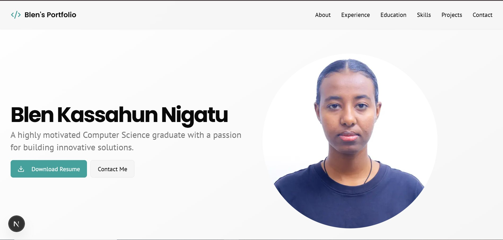
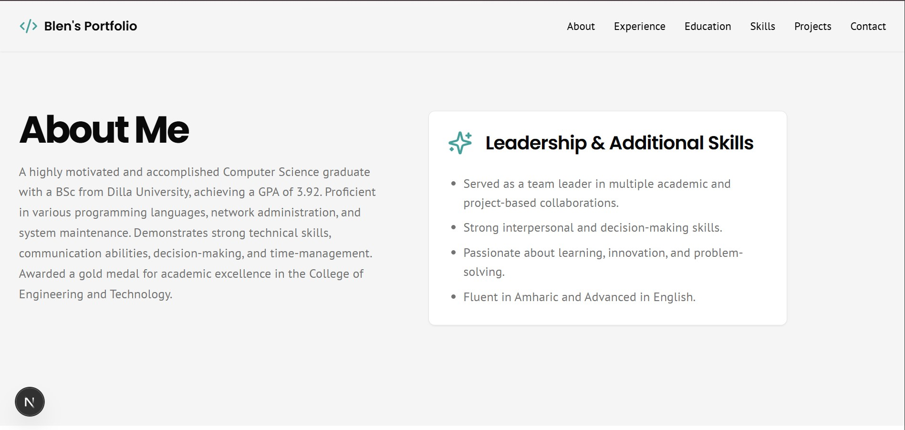
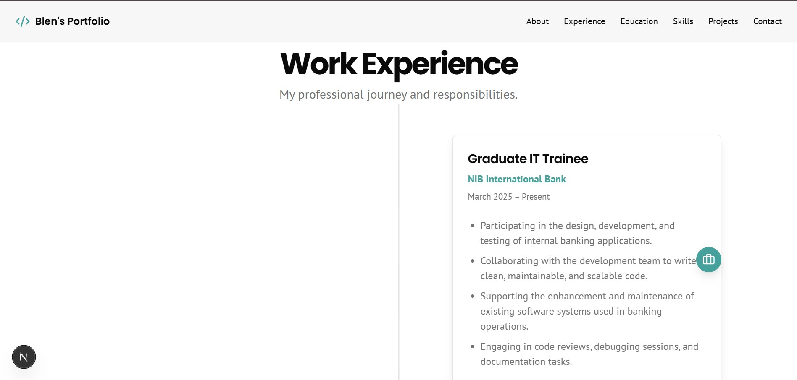
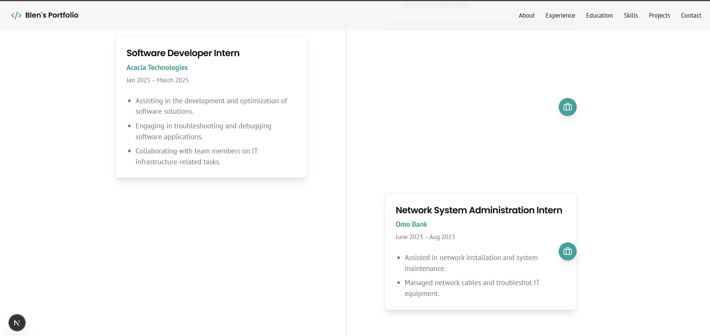
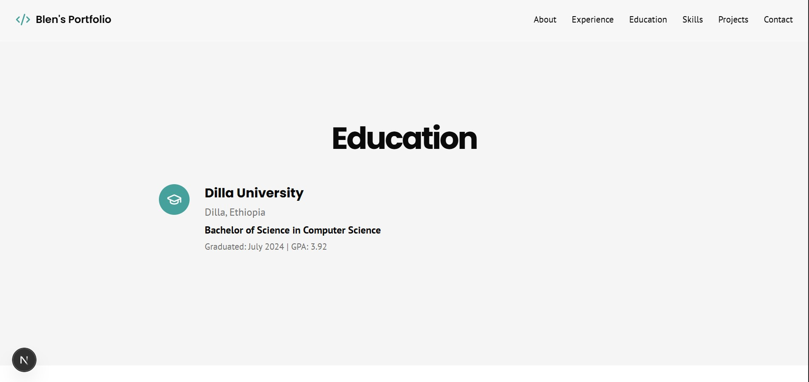
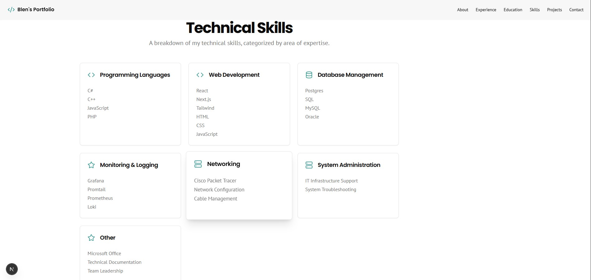
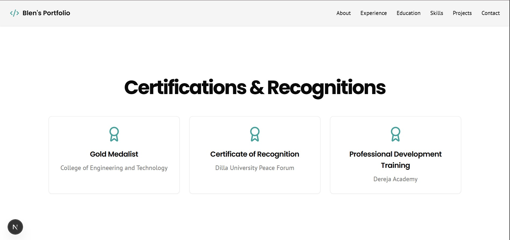
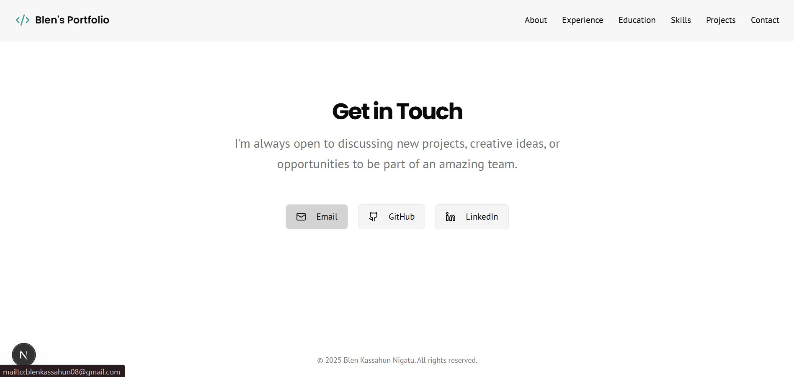

# 🌐 Personal Portfolio Website

A modern, responsive portfolio website built to showcase my background, skills, and projects.  
It serves as a digital resume and personal brand, helping potential clients and employers learn more about me.

---

## ✨ Sections

- **About** – A brief introduction about me and my journey.  
- **Experience** – Professional and internship experience.  
- **Education** – Academic background and achievements.  
- **Skills** – Technical skills, tools, and technologies I work with.  
- **Projects** – Selected projects with descriptions
- **Contact** – Easy way to connect with me (email, social media, etc.).  

---

## 🛠️ Tech Stack
- **Framework:** Next.js (React + TypeScript)  
- **Styling:** Tailwind CSS  
- **Deployment:** Vercel  
- **Other Tools:** GitHub Page

---

## 📸 Screenshots









---

## 🔗 Live Demo
👉 [View Portfolio]((https://portifolio-qumnqh253-blen000s-projects.vercel.app))  

---

## 🚀 Getting Started

### Clone the Repository
```bash
git clone https://github.com/blen000/portfolio.git
cd portfolio
